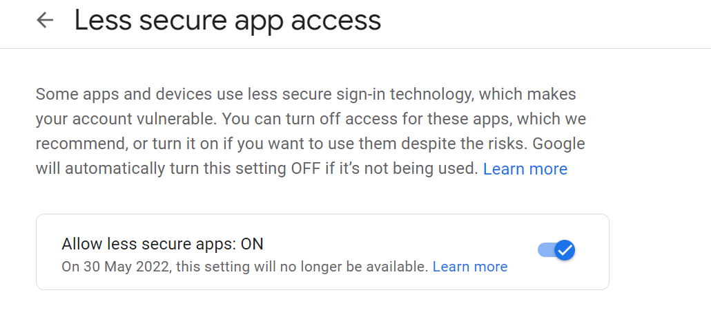
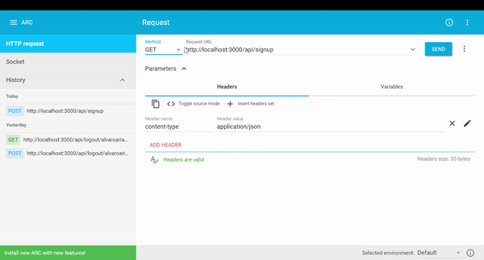
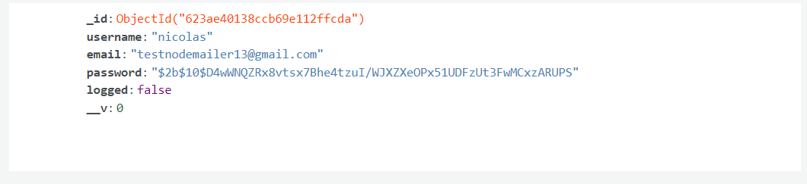
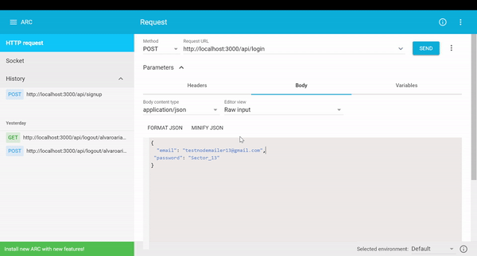

# JWT Nodemailer Workshop :e-mail:

API REST of user login/sign-up, logout and view and edit a list of products with with Node.js, Express and MongoDB using jwt(jsonwebtoken) authentication and Nodemailer to reset and recover password

## Libraries

- Express
- Bcrypt
- Nodemailer
- Dotenv
- Jsonwebtoken
- Mongoose
- Nodemailer
- Pug

## Tutorial

The first step is to change the configuration of your Google account to allow less secure app access to send mails by nodemailer.

Then go to your Rest Client (I use Advanced Rest Client) and make your signup request.

This will create a document in your DB with tha user data. Logged value will be false by default.

Make a login request using your user data. Then copy and save the token.

The logged value will change to true.

Now, paste your token in the header and make a GET request to see the products.

You can make POST request to create a product and insert it in the DB.

If you make a logout, the logged value will change to false and you wouldn't get or create products untill login again.

To send a recover password email make a GET request with the user email.

Now go to your email inbox and you will see the sent email to recover your password, click and copy the URL in to your Rest Client, make a PUT request and send in the boby the new password.

Login with the new password.

